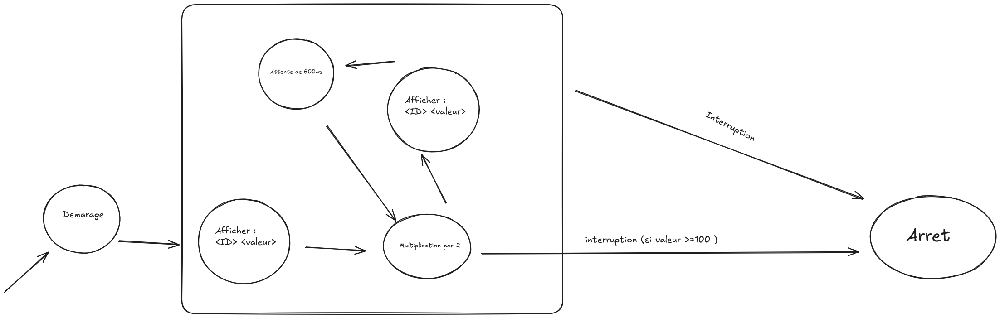

## Exercice 1 : Threads et agents

### Version A : Simples Agents

#### 1. Modéliser avec une machine à états finis le comportement de l'agent



Les différents états de l'agent sont :

* **Affichage** : l'agent affiche son identifiant et sa valeur.
* **Attente** : l'agent attend 500 ms.
* **Multiplication** : l'agent multiplie sa valeur par 2.
* Après la multiplication, si la valeur est supérieure ou égale à 100, l'agent est interrompu.
* Sinon, il revient à l'état **Affichage**.

---

#### 2. Classe `Launcher`

```java
import java.util.Random;

public class Launcher {

    final static int NB_AGENT = 6;

    public static void main(String[] args) {

        int k = 1;

        for (int i = 1; i <= NB_AGENT; i++) {

            Agent ag = new Agent(i, 1 + k);

            ag.start();

            k++;
        }
    }
}
```

---

#### 3. Classe `Agent`

```java
public class Agent extends Thread {

    private int value;
    private int id = 0;

    private boolean state_affiche = true;
    private boolean state_multiply = false;
    private boolean state_attente = false;

    public Agent(int id, int value) {
        this.id = id;
        this.value = value;
    }

    public void run() {

        while (!Thread.currentThread().isInterrupted()) {

            if (this.state_affiche) {

                System.out.println(
                    "Agent_id:" + this.id + " value:" + this.value
                );

                this.state_affiche = false;
                this.state_attente = true;

            } else if (this.state_multiply) {

                this.value *= 2;

                this.state_multiply = true;

                if (this.value >= 100) {
                    Thread.currentThread().interrupt();
                }

                this.state_affiche = true;

            } else if (this.state_attente) {

                try {
                    Thread.currentThread().sleep(500);
                } catch (InterruptedException e) {}

                this.state_attente = false;
                this.state_multiply = true;
            }
        }
    }
}
```

---

#### 4. Création et démarrage des 6 agents

Les agents sont créés avec les identifiants de `1` à `6` et les valeurs initiales de `2` à `7`.

| Agent   | Valeur initiale |
| ------- | --------------: |
| Agent 1 |               2 |
| Agent 2 |               3 |
| Agent 3 |               4 |
| Agent 4 |               5 |
| Agent 5 |               6 |
| Agent 6 |               7 |

### a. D'après vous, quel agent va se terminer le premier ? Le dernier ?

Les différentes exécutions montrent que l'ordre d'exécution des agents change.

Par exemple, dans les trois exécutions réalisées :

**Exécution 1 :**

```text
Agent_id:1
Agent_id:2
Agent_id:4
Agent_id:3
Agent_id:6
Agent_id:5
...
```

**Exécution 2 :**

```text
Agent_id:4
Agent_id:3
Agent_id:6
Agent_id:2
Agent_id:5
Agent_id:1
...
```

**Exécution 3 :**

```text
Agent_id:3
Agent_id:5
Agent_id:6
Agent_id:4
Agent_id:1
Agent_id:2
...
```

L'ordre d'affichage des agents est donc différent d'une exécution à l'autre.

---

## 5. Tests du système

### a. À quelle valeur se termine chaque agent ?

Chaque agent multiplie sa valeur par `2` jusqu'à obtenir une valeur supérieure ou égale à `100`.

| Agent   | Valeur initiale | Évolution                       | Valeur finale |
| ------- | --------------: | ------------------------------- | ------------: |
| Agent 1 |               2 | 2 → 4 → 8 → 16 → 32 → 64 → 128  |       **128** |
| Agent 2 |               3 | 3 → 6 → 12 → 24 → 48 → 96 → 192 |       **192** |
| Agent 3 |               4 | 4 → 8 → 16 → 32 → 64 → 128      |       **128** |
| Agent 4 |               5 | 5 → 10 → 20 → 40 → 80 → 160     |       **160** |
| Agent 5 |               6 | 6 → 12 → 24 → 48 → 96 → 192     |       **192** |
| Agent 6 |               7 | 7 → 14 → 28 → 56 → 112          |       **112** |

---

### b. Vérifiez votre prédiction précédente : dans quel ordre se terminent les agents ?

L'ordre de terminaison n'est pas identique à chaque exécution.

Les différentes sorties montrent que les agents ne sont pas exécutés dans le même ordre à chaque lancement du programme.

L'ordre observé dépend donc de l'exécution des différents threads.

---

### c. Combien de fois chaque agent exécute-t-il son calcul ?

Le calcul effectué par l'agent est :

```java
this.value *= 2;
```

Le nombre d'exécutions du calcul est :

| Agent   | Valeur initiale | Nombre de multiplications |
| ------- | --------------: | ------------------------: |
| Agent 1 |               2 |                     **6** |
| Agent 2 |               3 |                     **6** |
| Agent 3 |               4 |                     **5** |
| Agent 4 |               5 |                     **5** |
| Agent 5 |               6 |                     **5** |
| Agent 6 |               7 |                     **4** |

On obtient donc :

```text
Agent 1 → 6 calculs
Agent 2 → 6 calculs
Agent 3 → 5 calculs
Agent 4 → 5 calculs
Agent 5 → 5 calculs
Agent 6 → 4 calculs
```
