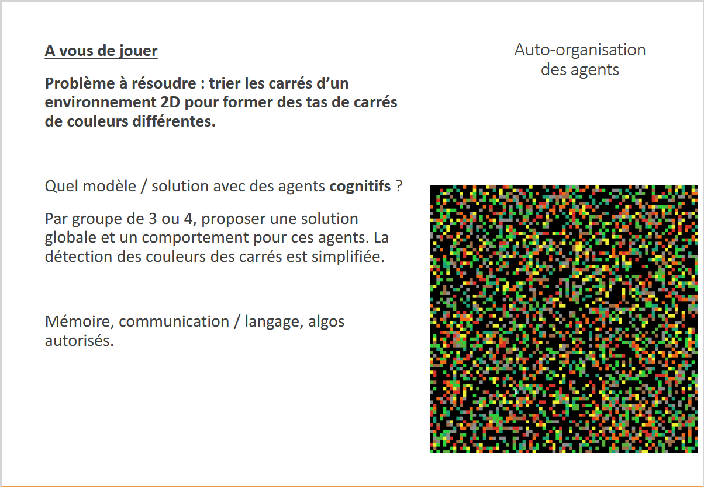
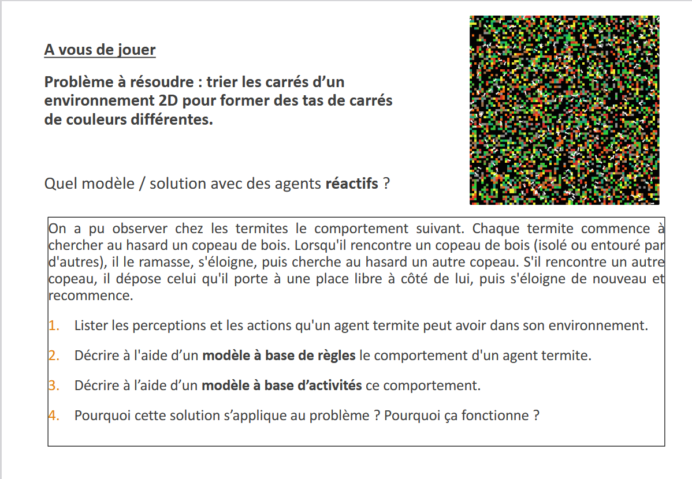

# Exercice — Auto-organisation des agents

  
  

Cette exercice est disponible dans le document distant à cette adresse : 

https://moodlesciences.univ-brest.fr/moodle/pluginfile.php/226988/mod_resource/content/0/Cours%20-%20SMA%20et%20R%C3%A9solution%20de%20probl%C3%A8mes.pdf

## Objectif

L’objectif de cet exercice est de concevoir, en groupe, une solution permettant à plusieurs agents autonomes de résoudre collectivement un problème d’organisation dans un environnement 2D.

Le travail porte sur la **conception du comportement des agents**, leur capacité à percevoir leur environnement et à agir en conséquence, ainsi que sur la manière dont leurs comportements individuels permettent d’aboutir à un comportement collectif.

---

## 1. Organisation du groupe

* Former un groupe de **3 ou 4 personnes**.
* Le groupe travaille sur **un problème commun**.
* Chaque membre doit réfléchir à la conception et au comportement d’un agent participant à la résolution du problème.
* Les différentes propositions devront ensuite être confrontées afin de construire une **solution globale cohérente**.

L’objectif n’est pas uniquement de décrire les agents individuellement, mais de comprendre comment leurs comportements peuvent fonctionner ensemble dans un même environnement.

---

## 2. Problème à résoudre

On considère un **environnement 2D contenant un grand nombre de carrés de différentes couleurs**, initialement répartis de manière désordonnée.

Le système doit permettre de transformer progressivement cet environnement afin de **regrouper les carrés par couleur**, de manière à former des ensembles distincts.

Le système est composé de plusieurs agents autonomes évoluant dans cet environnement.

### Situation initiale

Les carrés sont répartis aléatoirement dans l'environnement.

### Situation recherchée

Les carrés doivent progressivement être regroupés afin de former des ensembles correspondant aux différentes couleurs présentes.

La solution doit reposer sur les comportements des agents et sur leurs interactions avec leur environnement.

---

## 3. Travail demandé

Pour votre groupe, vous devrez :

### A. Définir le modèle des agents

Pour chaque agent proposé, préciser notamment :

* ce qu'il peut percevoir dans son environnement ;
* les informations dont il dispose ;
* les états dans lesquels il peut se trouver ;
* les actions qu'il peut effectuer ;
* les conditions qui provoquent un changement de comportement ;
* les éventuelles interactions avec les autres agents ;
* les informations qu'un agent peut conserver au cours de son fonctionnement.

### B. Définir le comportement

Décrire précisément le fonctionnement d'un agent sous une forme permettant de comprendre son comportement étape par étape.

La description devra permettre de répondre à des questions telles que :

* Que fait l'agent lorsqu'il démarre ?
* Que fait-il lorsqu'il rencontre un élément de l'environnement ?
* Comment décide-t-il de poursuivre, modifier ou arrêter son action ?
* Dans quelles situations son comportement évolue-t-il ?
* Comment plusieurs agents peuvent-ils fonctionner simultanément ?

### C. Définir le fonctionnement collectif

À partir des comportements individuels, expliquer comment le système complet fonctionne.

Il faudra notamment décrire :

* le rôle de chaque agent ;
* les interactions entre les agents ;
* la circulation éventuelle d'informations ;
* les conditions permettant aux agents de coopérer ;
* le fonctionnement global du système ;
* la manière dont le système évolue depuis l'état initial jusqu'à l'état recherché.

---

## 4. Modélisation

La solution devra être présentée sous une forme suffisamment précise pour pouvoir être comprise et discutée par l'ensemble du groupe.

Vous pourrez notamment utiliser :

* des schémas ;
* des diagrammes ;
* des tableaux ;
* des pseudo-codes ;
* des règles de comportement ;
* des diagrammes d'activités ;
* toute autre représentation pertinente.

Les choix de modélisation doivent permettre de distinguer clairement **le comportement individuel des agents** et **le comportement collectif du système**.

---

## 5. Contraintes

La solution doit respecter les contraintes suivantes :

* les agents doivent être **autonomes** ;
* le problème doit être traité dans un **environnement 2D** ;
* les carrés sont initialement répartis de manière désordonnée ;
* plusieurs agents doivent pouvoir fonctionner dans le même environnement ;
* le système doit permettre d'obtenir progressivement le regroupement recherché ;
* le comportement des agents doit être suffisamment défini pour pouvoir être simulé ou implémenté.

---

## 6. Livrable attendu

Le groupe doit produire un document présentant la solution complète.

Le document devra contenir au minimum :

1. **Présentation du problème**
2. **Description de l'environnement**
3. **Description des agents**
4. **Perceptions et actions disponibles**
5. **Comportement individuel des agents**
6. **Interactions entre les agents**
7. **Fonctionnement collectif**
8. **Modélisation du comportement**
9. **Déroulement global du système**
10. **Explication du résultat obtenu**

---

## 7. Présentation finale

Chaque groupe devra être capable de présenter sa solution et d'expliquer :

* les choix effectués pour les agents ;
* le comportement de chaque agent ;
* les interactions entre les agents ;
* le fonctionnement du système dans son ensemble ;
* l'évolution de l'environnement au cours de l'exécution ;
* les conditions permettant d'aboutir au résultat recherché.

L'objectif final est de proposer une **modélisation complète d'un système multi-agents capable de s'organiser collectivement pour résoudre le problème donné**.
